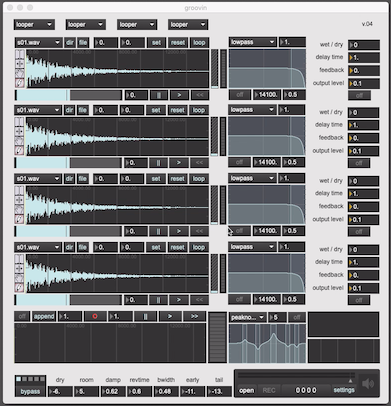
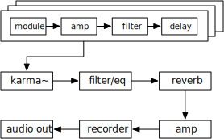

# Groovin v0.41

## Overview

A Max/Msp 4-track looper with overdubbing based on groove~ msp object and the karma~, spindrift~ and gigaverb~ externals.

Developed on Max 8 and is of now, OS X only (64-bit).

This project is/was an iterative product of my attempts over a summer to learn max/msp.

Please note that it assumes that you have a set of samples files (..wav or .aif) in `~/Music/samples`. These can be of pretty much of variable subject to the constraints of the max/msp engine and your computer.

A partial demo of the v0.4 features is available on [youtube](https://youtu.be/sKZO_4qYpj0)

## Externals

This project uses the following externals (OS X 64-bit):

- [karma~](https://cycling74.com/tools/karma-samplerlooper-external): for variabile speed overdubbing and looping.

- [spindrift~](http://www.michaelnorris.info/software/spindrift): for granular synthesis experimentation. 

- gigaverb, or more precisely, V. Boehm's [64-bit version](https://github.com/v7b1/gigaverb) of the original by Olaf Matthes implementated by Juhana Sadeharju), for reverb.

## Design

As of v0.4, the design is quite simple:

	sum(mi => ai => fi => di | i in 1 .. 4) => (k1 => f1 => r1) => dac

A single page patch with 4 gain-controlled channels each consisting of a module which can be either a (groove~) looper or a (spindrift~) granulator, a single pole filter and a mono delay, mixing into a (karma~) overdubber/looper which in turn feeds into an n-pole multi-filter/eq and then onto a reverb (gigaverb~) to audio out.

The design allows for:

1. Changing the type of channel: currently either a looper or a granulator via the 4 dropdown menus at the top.

2. Overdubbing into a 5th channel: the karma~ overdubber/looper records the mix of the 4 channels and then can be used as a seperate 5th channel thereafter during playback.

## Todo

**primary**

- [x] code naming improvement: `chan` (for channel) is composite and `mod` (for module)
- [x] clickless delays (see [ej.vdb~] or m4l.vdelay~ see [here](https://cycling74.com/forums/interpolating-delay/))
- [x] add switchable matrix input from channels to karma module, reverb, audio out)
- [ ] add a keyboard sampler module with midi input
- [ ] add modulation
- [ ] vst support
- [ ] more standalone polish
- [ ] better docs
- [ ] check ranges

**secondary**

- [ ] global timing support
	- [ ] clock division
	- [ ] ableton link support
- [ ] add stereo mixer
- [ ] polybuffer~ to load samples from folder?
- [ ] use poly~ ?

