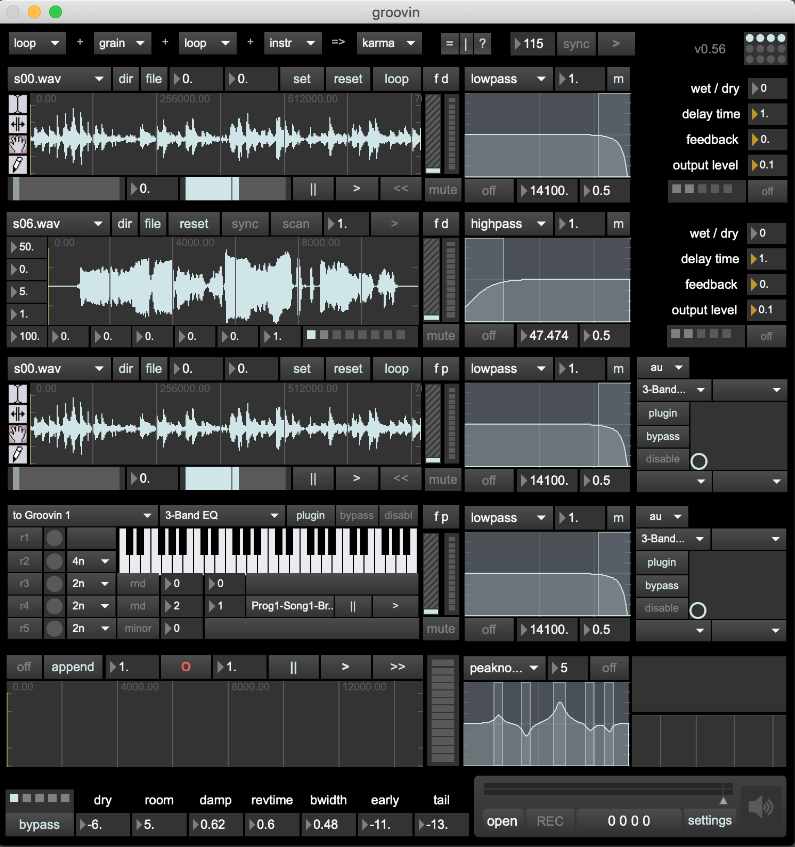

# Groovin v0.56

## Overview

A Max/Msp 4+1 channel looper with overdubbing based on the groove~ msp object and karma~, spindrift~ and gigaverb~ externals.

Developed on Max 8 and is of now, OS X only (64-bit).

This project is/was an iterative product of my attempts over a summer to learn max/msp.

Please note that it assumes that you have a set of samples files (..wav or .aif) in `~/Music/samples`. These can be of pretty much of any length subject to the constraints of the max/msp engine and your computer.

Currently at v0.56 with VST/AU and external MIDI support. 

A brief demo of the v0.4 features is available on [youtube](https://youtu.be/sKZO_4qYpj0)

The current version has more features though and looks like this:




## Design Spec

see tests/test_layout.maxpat


## Modules

```
channel
    loop
    grain
    instr
    karma with external input (planned)
    slicer (planned)
    stutter (planned)
    chucker (planned)


within channels you can change the fx chain:
    fd: filter -> delay
    fp: filter -> plugin
    pp: plugin -> plugin (planned)
    fa: filter -> amxd (planned)

mixer
    karma
    plugin
```

## Externals

This project uses the following externals (OS X 64-bit):

- [karma~](https://cycling74.com/tools/karma-samplerlooper-external): for variabile speed overdubbing and looping.

- [spindrift~](http://www.michaelnorris.info/software/spindrift): for granular synthesis experimentation. 

- gigaverb~, or more precisely, V. Boehm's [64-bit version](https://github.com/v7b1/gigaverb) of the original by Olaf Matthes implementated by Juhana Sadeharju), for reverb.


## Design

The design allows for:

1. Changing the type of channel: currently either a looper, a granulator, a radnom midi generator via the 4 dropdown menus at the top. Each channel has two fx slots (currently a filter/delay or filter/plugin)

2. Overdubbing into a 5th channel: the karma~ overdubber/looper records the mix of the 4 channels and then can be used as a seperate 5th channel thereafter during playback.


## Todo

**primary**

- [ ] add csound~ as an engine
- [ ] use gen~ as an egine
- [ ] use poly~ for fx chain
- [ ] add switch on 5th channel to change filter to plugin
- [x] fx switch at module within channel instead of changing channel itself
- [ ] smoother gain inc/dec (adjust approprirate param in gain~)
- [ ] looper reverse button should actually reverse instead of going to -1
- [ ] normalize button size and ui cleanup
- [ ] more standalone polish
- [x] add per channel pre-fader pre-fx mute
- [ ] add modulation
- [ ] improve docs
- [ ] check ranges
- [ ] add amxd plugins

**secondary**

- [x] global timing support
	- [x] clock division
	- [ ] ableton link support
- [ ] add stereo mixer
- [ ] polybuffer~ to load samples from folder?
- [ ] use poly~ ?

