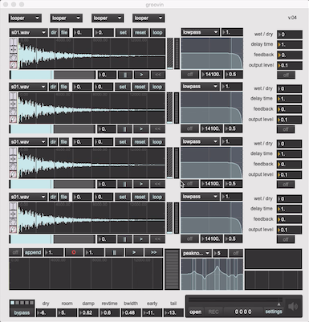

# Groovin v0.4

## Overview

A Max/Msp looping sample player based on groove~ msp object and the karma~, spindrift~ and gigaverb~ externals. It was developed on Max 8 and is Max OS X only (64-bit).

This project is/was an iterative product of my attempts over a summer to learn max/msp.

Please note that it assumes that you have a set of samples files (wave or aif) in `~/Music/samples`. These can be of pretty much of any length within the constraints of the max/msp engine and your computer.

A partial demo of the features is available on [youtube](https://youtu.be/sKZO_4qYpj0)

## Externals

This project uses 

- gigaverb~, or more precisely, V. Boehm's [64-bit version](https://github.com/v7b1/gigaverb) of the original, for reverb.

- [karma~](https://cycling74.com/tools/karma-samplerlooper-external): for variabile speed overdubbing and looping.

- [spindrift~](http://www.michaelnorris.info/software/spindrift): for granular synthesis experimentation. 

## Design

As of v0.4, the design is pretty simple:

	sum(mi => ai => fi => di | i in 1 .. 4) => (k1 => f1 => r1) => dac

A single page path with 4 gain-controlled channels each consisting of a module which can be either a (groove~) looper  or a (spindrift~) granulator, a single pole filter and a mono delay, mixing into a (karma~) recorder/looper which in turn feeds into n-pole multi-filter and (gigaverb~) reverb feeding into the dac~.

The key feature is that you can on a per-channel basis, via 4 dropdown menus at the top, pick whether a module is a looper or a granulator. This modularilty allow for future extension, of course, and I have I'd like to build other 'modules' in the future, such as a midi or sequencer controlled sampler and include vst-support for example. 

Next priorities are to add stereo support and further modulation options. 

## Todo

primary

- [ ] code naming improvement: `chan` (for channel) is composite and `mod` (for module)
- [ ] more standalone polish
- [ ] better docs
- [ ] add switchable input to karma module (either interal channels or adc~)
- [ ] clickless delays (see [ej.vdb~] or m4l.vdelay~ see [here](https://cycling74.com/forums/interpolating-delay/))
- [ ] vst support
- [ ] add modulation
- [ ] add a keyboard sampler module with midi input

secondary

- [ ] add stereo mixer
- [ ] polybuffer~ to load samples from folder?
- [ ] use poly~ ?
- [ ] ableton link support

